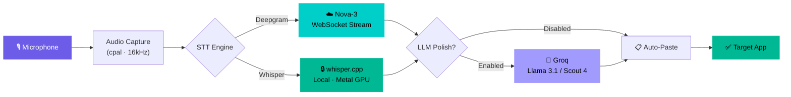

<p align="center">
  
</p>

<h1 align="center">VoxForge</h1>

<p align="center">
  <strong>Real-time AI voice-to-text dictation that lives in your menubar.</strong><br/>
  Speak naturally. Get polished text. Pasted instantly.
</p>

<p align="center">
  <a href="https://github.com/thanseefpp/VoxForge/releases/latest"></a>
  <a href="https://github.com/thanseefpp/VoxForge/stargazers"></a>
  <a href="https://github.com/thanseefpp/VoxForge/blob/main/LICENSE"></a>
  
</p>

<p align="center">
  
  
  
  
</p>

---

## ✨ What is VoxForge?

VoxForge is a **native macOS dictation app** that transcribes your speech in real-time and optionally polishes it with AI before pasting it into any app. It sits quietly in your menubar as a floating bubble — click, speak, done.

**No Electron. No browser. No lag.** Built with Tauri v2 + Rust for native performance.

---

## 🌟 Features

| | Feature | Description |
|---|---------|-------------|
| ⚡ | **Real-time Streaming STT** | Word-by-word transcription using Deepgram Nova-3 WebSocket |
| 🔒 | **Offline Whisper** | Local transcription with whisper.cpp — no internet needed |
| 🧠 | **LLM Polish** | Transform raw speech into clean code, emails, or prose via Groq |
| 🫧 | **Floating Bubble** | Click-through overlay with live waveform visualization |
| 📋 | **Auto-Paste** | Transcribed text goes straight into your focused app |
| 🎛️ | **Model Choice** | Pick Whisper Small (fast) or Large v3 Turbo (best accuracy) |
| 🔑 | **Bring Your Keys** | Use your own Deepgram & Groq API keys — your data, your control |
| 🎨 | **Premium UI** | Dark glassmorphism design with smooth micro-animations |

---

## 📥 Download

> **Get the latest release** → [**GitHub Releases**](https://github.com/thanseefpp/VoxForge/releases/latest)

| Chip | Download |
|------|----------|
| 🍎 **Apple Silicon** (M1/M2/M3/M4) | `VoxForge_*_aarch64.dmg` |
| 💻 **Intel Mac** | `VoxForge_*_x64.dmg` |

<details>
<summary>⚠️ macOS Gatekeeper — First launch instructions</summary>

Since VoxForge isn't signed with an Apple Developer certificate yet:
1. Download the `.dmg` file
2. Drag **VoxForge.app** to Applications
3. **Right-click** → **Open** (don't double-click)
4. Click **Open** in the dialog

You only need to do this once.
</details>

---

## 🔧 Architecture



---

## 🚀 Quick Start

### Prerequisites

- **macOS** 12+ (Apple Silicon or Intel)
- **Rust** — [Install via rustup](https://rustup.rs/)
- **Node.js** 18+ — [nodejs.org](https://nodejs.org/)
- Xcode Command Line Tools:
  ```bash
  xcode-select --install
  ```

### Install & Run

```bash
# Clone
git clone https://github.com/thanseefpp/VoxForge.git
cd VoxForge

# Install dependencies
npm install

# Run in dev mode
npm run tauri dev
```

### Configure API Keys

Open the settings window and enter your API keys:

| Service | Purpose | Get a Key |
|---------|---------|-----------|
| **Deepgram** | Real-time streaming STT | [deepgram.com](https://console.deepgram.com/signup) (free tier) |
| **Groq** | LLM prompt polishing | [groq.com](https://console.groq.com/) (free tier) |
| **Whisper** | Offline STT | No key needed — runs locally! |

---

## 🎙️ STT Engines

### ☁️ Deepgram Nova-3

The cloud-powered engine for **real-time, word-by-word** transcription:

- Industry-leading accuracy (54% lower WER than competitors)
- Sub-second latency via WebSocket streaming
- English language (`en`)

### 🔒 Whisper (Offline)

Fully local transcription using [whisper.cpp](https://github.com/ggerganov/whisper.cpp) with **Metal GPU acceleration**:

| Model | File | Size | Speed | Accuracy |
|-------|------|------|-------|----------|
| **Small Q8** | `ggml-small-q8_0.bin` | ~180 MB | ⚡ Fast | Good |
| **Large v3 Turbo Q8** | `ggml-large-v3-turbo-q8_0.bin` | ~810 MB | 🐢 Slower | Best |

Models are **downloaded on-demand** with a progress bar — not bundled with the app.  
Cached at `~/.voxforge/models/`.

---

## 🧠 LLM Polish

When enabled, raw transcriptions are refined by **Groq** before pasting:

| Mode | What it does |
|------|-------------|
| **Direct** | No polishing — raw transcript |
| **Coding** | Converts speech to clean code snippets |
| **Email** | Formats as professional email prose |
| **General** | Fixes grammar, punctuation, clarity |
| **Custom** | Your own system prompt |

Supported models: `llama-3.1-8b-instant` · `meta-llama/llama-4-scout-17b-16e-instruct`

---

## 🏗️ Project Structure

```
VoxForge/
├── src/                          # 🎨 React Frontend
│   ├── App.tsx                   #   Settings page
│   ├── App.css                   #   Settings styles
│   ├── OverlayApp.tsx            #   Floating bubble overlay
│   ├── overlay.css               #   Overlay styles
│   ├── main.tsx                  #   Settings entry point
│   └── overlay-main.tsx          #   Overlay entry point
│
├── src-tauri/                    # ⚙️ Rust Backend
│   └── src/
│       ├── lib.rs                #   Core logic & Tauri commands
│       ├── audio.rs              #   Audio capture (cpal)
│       ├── deepgram.rs           #   Deepgram WebSocket client
│       ├── whisper.rs            #   Whisper offline transcription
│       ├── groq.rs               #   Groq LLM client
│       ├── focus.rs              #   macOS focus tracking
│       └── paste.rs              #   Clipboard & paste simulation
│
├── index.html                    # Settings window HTML
├── overlay.html                  # Overlay window HTML
├── package.json
├── vite.config.ts
├── LICENSE
├── CONTRIBUTING.md
└── CODE_OF_CONDUCT.md
```

---

## 🛠️ Tech Stack

<table>
  <tr>
    <td align="center" width="96">
      <br/>
      <strong>Tauri v2</strong><br/>
      <sub>App Framework</sub>
    </td>
    <td align="center" width="96">
      <br/>
      <strong>Rust</strong><br/>
      <sub>Backend</sub>
    </td>
    <td align="center" width="96">
      <br/>
      <strong>React 19</strong><br/>
      <sub>Frontend</sub>
    </td>
    <td align="center" width="96">
      <br/>
      <strong>TypeScript</strong><br/>
      <sub>Type Safety</sub>
    </td>
    <td align="center" width="96">
      <br/>
      <strong>Vite</strong><br/>
      <sub>Build Tool</sub>
    </td>
  </tr>
</table>

| Component | Technology |
|-----------|-----------|
| Audio Capture | `cpal` (cross-platform) |
| Deepgram WebSocket | `tungstenite` + native TLS |
| Whisper Inference | `whisper-rs` + Metal GPU |
| LLM API | `reqwest` → Groq |
| Clipboard | `arboard` |
| macOS Native | `objc` + `cocoa` + `core-graphics` |

---

## 🤝 Contributing

Contributions are welcome! Please read our [Contributing Guide](CONTRIBUTING.md) and [Code of Conduct](CODE_OF_CONDUCT.md) before getting started.

```bash
# Fork → Clone → Branch → Code → PR
git checkout -b feat/your-feature
```

---

## 📝 License

This project is licensed under the **MIT License** — see the [LICENSE](LICENSE) file for details.

---

## 🙏 Acknowledgments

- [Deepgram](https://deepgram.com/) — Real-time speech-to-text API
- [Groq](https://groq.com/) — Ultra-fast LLM inference
- [whisper.cpp](https://github.com/ggerganov/whisper.cpp) — Efficient Whisper inference in C++
- [Tauri](https://tauri.app/) — Native app framework for Rust + Web
- [OpenAI Whisper](https://github.com/openai/whisper) — Original Whisper model

---

<p align="center">
  <sub>Built with ❤️ by <a href="https://github.com/thanseefpp">thanseefpp</a></sub>
</p>
